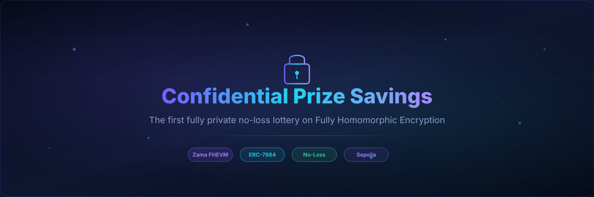
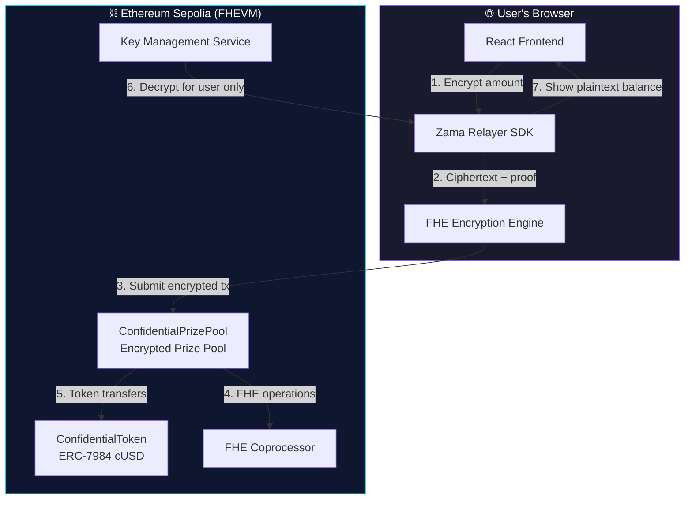
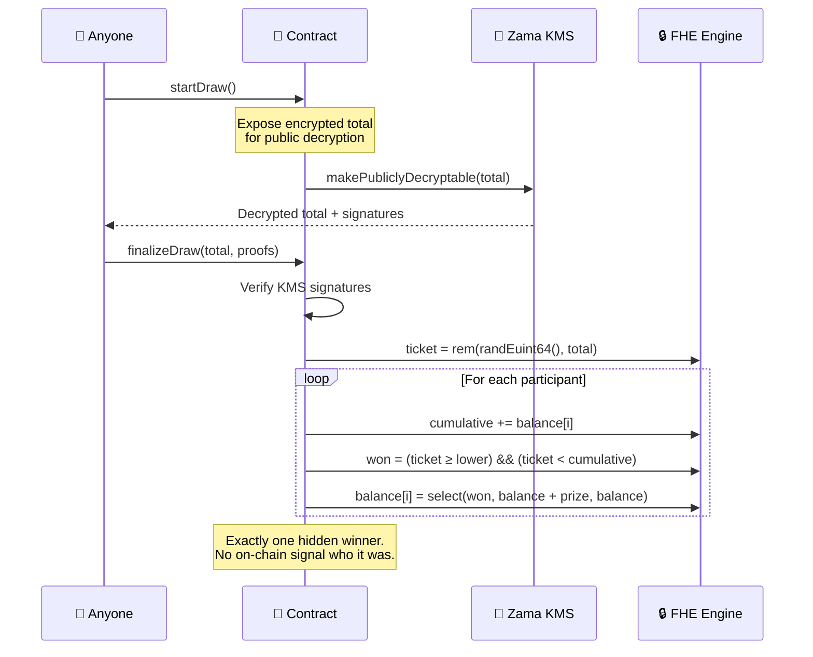

<div align="center">


<br /><br />

# 🔐 Confidential Prize Savings

### *The first fully private no-loss lottery on Fully Homomorphic Encryption*

<br />

**Deposits are encrypted. Balances are hidden. The winner is secret.**<br/>
Save together, one depositor wins the prize each round, nobody loses principal — and privacy is preserved end-to-end.

<br />

[🌐 Live Demo](https://zkasuran.github.io/confidential-prize-savings-app/) · [📄 Contracts on Etherscan](https://sepolia.etherscan.io/address/0x89EE395e44bD7F7401D47805550f9dc424b9D553)

<br />



</div>

---

## 🏆 Hackathon Submission

> **Zama Developer Program — Mainnet Season 4, Bounty Track**

| Category | Details |
|----------|---------|
| **Track** | Zama Bounty — Confidential DeFi |
| **Chain** | Ethereum Sepolia (FHEVM) |
| **Status** | ✅ Live & Deployed |
| **Tests** | ✅ 7/7 passing (FHEVM mock) |
| **Lint** | ✅ Zero warnings (solhint + eslint + prettier) |

---

## 💡 The Problem

Traditional prize-savings protocols like PoolTogether leak **everything** on-chain:

- 💸 How much you deposited
- 📊 Your running balance  
- 🏦 How big the prize is
- 🏆 Who won each round

This creates privacy risks, front-running opportunities, and social pressure that deters participation.

## ✨ The Solution

**Confidential Prize Savings** is a fully private, no-loss prize pool where:

| Feature | Traditional Pool | Our Protocol |
|---------|-----------------|--------------|
| Deposit amounts | Public | 🔒 **Encrypted** |
| Account balances | Public | 🔒 **Encrypted** |
| Prize pot size | Public | 🔒 **Encrypted** |
| Winner identity | Public | 🔒 **Encrypted** |
| Principal safety | ✅ | ✅ |

The **only** value ever revealed is the aggregate pool TVL at draw time — the absolute minimum disclosure needed for a fair deposit-weighted draw.

---

## 🔑 Key Features

<table>
<tr>
<td width="50%">

### 🛡️ End-to-End Encryption
Every deposit, balance, prize amount and winner selection is computed entirely under **Fully Homomorphic Encryption** (FHE). Values are encrypted in-browser before touching the chain.

</td>
<td width="50%">

### 🎲 Fair Weighted Draw
The on-chain CSPRNG generates a deposit-weighted random ticket under FHE. Larger depositors have proportionally higher odds — but nobody can see anyone's weight.

</td>
</tr>
<tr>
<td>

### 💰 No-Loss Guarantee
Principal is **always** redeemable. Over-withdrawals are clamped to zero under FHE (`select(le(request, balance), request, 0)`). Winning only adds — never subtracts.

</td>
<td>

### 🕵️ Hidden Winners
The winner is credited under `FHE.select` — every participant's balance update looks identical on-chain. You discover you won by decrypting your own balance privately.

</td>
</tr>
</table>

---

## 🏗️ Architecture



### 🎯 Draw Flow (The Hard Part)

Selecting a deposit-weighted winner over encrypted balances is novel because FHE has **no encrypted-modulo-by-encrypted** operation. Our approach:



---

## 📂 Project Structure

```
confidential-prize-savings/
├── 📜 hardhat/                          Solidity + Tests + Deployment
│   ├── contracts/
│   │   ├── ConfidentialPrizePool.sol     The confidential no-loss prize pool
│   │   ├── ConfidentialToken.sol         ERC-7984 confidential token (cUSD)
│   │   └── automation/
│   │       └── AutoDraw.sol              Chainlink Automation keeper for draws
│   ├── test/
│   │   └── ConfidentialPrizePool.ts      7 tests on FHEVM mock coprocessor
│   ├── deploy/
│   │   └── deploy.ts                     Hardhat-deploy script (Sepolia)
│   └── tasks/
│       └── PrizePool.ts                  CLI: faucet, deposit, balance, draw
│
├── 🌐 frontend/                         Vite + React + TypeScript (PWA)
│   ├── public/
│   │   └── manifest.json                PWA manifest
│   └── src/
│       ├── App.tsx                       Main dApp interface
│       ├── components/
│       │   ├── Confetti.tsx              🎉 Win detection celebration
│       │   ├── FeatureCards.tsx           Feature showcase grid
│       │   ├── HowItWorks.tsx            Visual encryption flow
│       │   ├── ParticleBackground.tsx    Animated particle canvas
│       │   ├── RoundHistory.tsx          Multi-round draw history
│       │   ├── StatsCounter.tsx          Animated counting numbers
│       │   └── Toast.tsx                 Notification system
│       ├── abi.ts                        Contract ABIs
│       ├── config.ts                     Chain & address config
│       ├── decrypt.ts                    EIP-712 user decryption
│       ├── fhevm.ts                      Zama Relayer SDK singleton
│       └── styles.css                    Modern glassmorphism theme
│
├── 📊 subgraph/                         The Graph (Event Indexer)
│   ├── schema.graphql                   Entity definitions
│   ├── subgraph.yaml                    Data source config
│   └── src/mapping.ts                   Event handlers
│
├── 📚 docs/
│   ├── ARCHITECTURE.md                  System design + threat model
│   └── DEMO_SCRIPT.md                   Judge walkthrough storyboard
│
├── 🔄 .github/
│   ├── workflows/ci.yml                 CI: tests + build + deploy
│   └── assets/hero-banner.svg           README banner
│
├── CONTRIBUTING.md                      Open-source contribution guide
├── SECURITY.md                          Security policy + threat model
└── 📖 README.md                         This file
```

---

## 🛠️ Tech Stack

| Layer | Technology | Purpose |
|-------|-----------|---------|
| **FHE** | [Zama FHEVM](https://docs.zama.ai/fhevm) | Encrypted computation on-chain |
| **Token Standard** | [ERC-7984](https://eips.ethereum.org/EIPS/eip-7984) | Confidential fungible token interface |
| **Smart Contracts** | Solidity 0.8.27 | Pool logic, draw mechanics |
| **Contract Framework** | Hardhat 2.28 | Testing, deployment, tasks |
| **FHE Libraries** | @fhevm/solidity ^0.11 | `euint64`, `ebool`, FHE ops |
| **OZ Contracts** | @openzeppelin/confidential-contracts | ERC-7984 base implementation |
| **Frontend** | React 18 + TypeScript 5.9 | Modern SPA |
| **Build** | Vite 5.4 | Fast dev & production builds |
| **Blockchain** | ethers 6.16 | Contract interaction |
| **Encryption SDK** | @zama-fhe/relayer-sdk 0.4 | Browser-side FHE encryption |
| **Network** | Ethereum Sepolia | Testnet with FHEVM support |
| **Automation** | Chainlink Automation v2 | Scheduled keeper draws |
| **Indexing** | The Graph | Event indexing + history queries |

---

## 🚀 Live Deployment

| Contract | Address | Etherscan |
|----------|---------|-----------|
| **ConfidentialToken (cUSD)** | `0x57aF4e4B482Ab1bb4f9d1aeb5206258a7Def0eaf` | [View →](https://sepolia.etherscan.io/address/0x57aF4e4B482Ab1bb4f9d1aeb5206258a7Def0eaf) |
| **ConfidentialPrizePool** | `0x89EE395e44bD7F7401D47805550f9dc424b9D553` | [View →](https://sepolia.etherscan.io/address/0x89EE395e44bD7F7401D47805550f9dc424b9D553) |

🌐 **Frontend:** [https://zkasuran.github.io/confidential-prize-savings-app/](https://zkasuran.github.io/confidential-prize-savings-app/)

---

## 🧪 Testing

The test suite runs 7 tests against the FHEVM mock coprocessor covering:

| # | Test | What It Proves |
|---|------|----------------|
| 1 | Faucet mint | Encrypted balance readable by holder |
| 2 | Deposit | Funds transfer, participant tracking |
| 3 | Withdraw + over-withdraw | No-loss guarantee, clamping |
| 4 | Solo winner | Deterministic prize award |
| 5 | Multi-depositor draw | Conservation, exactly one winner |
| 6 | Draw lock + cancel | Deposits paused during draw |
| 7 | Revert on invalid state | Error handling |

```bash
cd hardhat
npm install
npx hardhat test
```

```
  ConfidentialPrizePool
    ✓ faucet mints an encrypted token balance the holder can decrypt
    ✓ deposit moves encrypted funds into the pool and tracks the participant
    ✓ withdraw is no-loss and clamps an over-withdrawal to zero
    ✓ a sole depositor wins the whole sponsored prize (deterministic)
    ✓ awards the prize to exactly one of several depositors
    ✓ locks deposits while a draw is pending and reopens after cancel
    ✓ reverts a draw with no participants and a finalize with no draw

  7 passing
```

---

## 🏃 Quick Start

### Prerequisites

- Node.js 18+
- MetaMask (or any EIP-1193 wallet)
- Sepolia ETH for gas ([faucet](https://sepoliafaucet.com))

### Smart Contracts

```bash
cd hardhat
npm install

# Run tests (FHEVM mock)
npx hardhat test

# Lint
npm run lint

# Deploy to Sepolia
npx hardhat vars set MNEMONIC
npx hardhat deploy --network sepolia --tags ConfidentialPrizePool
```

### Frontend

```bash
cd frontend
npm install
npm run dev          # → http://localhost:5173
npm run build        # Production build
```

### CLI Tasks

```bash
# Mint test tokens
npx hardhat task:faucet --amount 100 --network sepolia

# Check pool info
npx hardhat task:pool-info --network sepolia

# Deposit into the pool
npx hardhat task:deposit --amount 50 --network sepolia

# Check your encrypted balance
npx hardhat task:balance --network sepolia
```

---

## 🔒 Privacy Model

```
┌─────────────────────────────────────────────────────────────────────┐
│                        ON-CHAIN (ENCRYPTED)                         │
├─────────────────────────────────────────────────────────────────────┤
│  • Individual deposits      → euint64 (opaque to all)              │
│  • Account balances         → euint64 (owner-decryptable only)     │
│  • Prize pot                → euint64 (opaque to all)              │
│  • Winner selection         → ebool per account (all look same)    │
│  • Token transfers          → euint64 (confidential amounts)       │
├─────────────────────────────────────────────────────────────────────┤
│                     ON-CHAIN (PUBLIC — MINIMAL)                     │
├─────────────────────────────────────────────────────────────────────┤
│  • Aggregate pool TVL       → revealed ONLY at draw time           │
│  • Participant addresses    → publicly listed (who is in the pool) │
│  • Round counter            → public metadata                      │
└─────────────────────────────────────────────────────────────────────┘
```

**Why reveal the aggregate?** FHE provides only `rem(euint64, uint64)` (scalar modulus), not encrypted-modulo-by-encrypted. To draw a uniform ticket in `[0, total)` we need `total` as plaintext. This is the same TVL number any savings pool shows publicly — no individual information leaks.

---

## 🧠 Innovation Highlights

1. **Novel FHE Draw Mechanism** — First implementation of a deposit-weighted random draw entirely under FHE using cumulative-sum range matching with `FHE.select`

2. **Minimal Disclosure Design** — Only reveals aggregate TVL (already public in traditional pools), keeping individual positions secret

3. **In-Browser Encryption** — User inputs are encrypted client-side before any on-chain submission, using the Zama Relayer SDK's WASM engine

4. **ERC-7984 Pioneer** — Early adopter of the confidential token standard with full integration into a DeFi primitive

5. **Production-Ready Testing** — Full mock-coprocessor test suite validating correctness of encrypted arithmetic, state transitions, and edge cases

6. **Autonomous Operation** — Chainlink Automation keeper enables fully trustless, scheduled draw execution without manual intervention

7. **Privacy-Preserving Indexing** — The Graph subgraph indexes public events while explicitly documenting what remains encrypted — demonstrating that composability and privacy can coexist

8. **Win Detection UX** — Frontend compares previous encrypted balance to current one after user decryption, triggering confetti celebration when a win is detected — all without any on-chain signal

---

## 🗺️ Roadmap

- [x] Core smart contracts with FHE prize draw
- [x] ERC-7984 confidential token
- [x] Full test suite (7 tests, mock coprocessor)
- [x] React frontend with in-browser encryption
- [x] Live deployment on Sepolia
- [x] User-side balance decryption (EIP-712)
- [x] Chainlink Automation keeper contract (AutoDraw)
- [x] The Graph subgraph for event indexing
- [x] CI/CD pipeline (tests + build + deploy)
- [x] Win detection with confetti celebration 🎉
- [x] Multi-round history display
- [x] PWA manifest for mobile installation
- [x] Architecture documentation + threat model
- [x] Demo walkthrough script for judges
- [ ] Multi-token prize pools
- [ ] Governance for draw parameters
- [ ] Mainnet deployment (pending FHEVM mainnet)
- [ ] Integration with yield sources for real prize generation

---

## 👤 Author

**zkasuran** — Building confidential DeFi primitives on FHE

---

## 🧩 Third-party notice

`frontend/public/coi-serviceworker.js` is
[coi-serviceworker](https://github.com/gzuidhof/coi-serviceworker) v0.1.7 by Guido Zuidhof and
contributors, MIT licensed, included verbatim with its licence header intact. It registers a service
worker that re-serves the page with `Cross-Origin-Opener-Policy` and `Cross-Origin-Embedder-Policy`
set, which is how the Relayer SDK's WebAssembly obtains `SharedArrayBuffer` on a static host that
cannot set response headers.

## 📜 License

[BSD-3-Clause-Clear](./LICENSE) — matching the FHEVM ecosystem license.

---

## 🙏 Acknowledgments

- [Zama](https://www.zama.ai/) — FHEVM, fhEVM Solidity library, Relayer SDK
- [OpenZeppelin](https://www.openzeppelin.com/) — Confidential Contracts (ERC-7984)
- [PoolTogether](https://pooltogether.com/) — Inspiration for the no-loss prize model

---

<div align="center">

**Built with 🔐 FHE for a more private DeFi**


</div>
